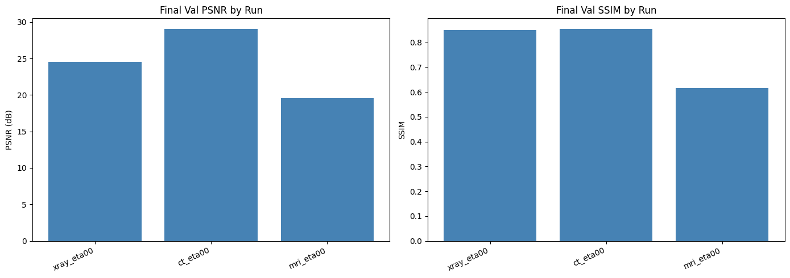
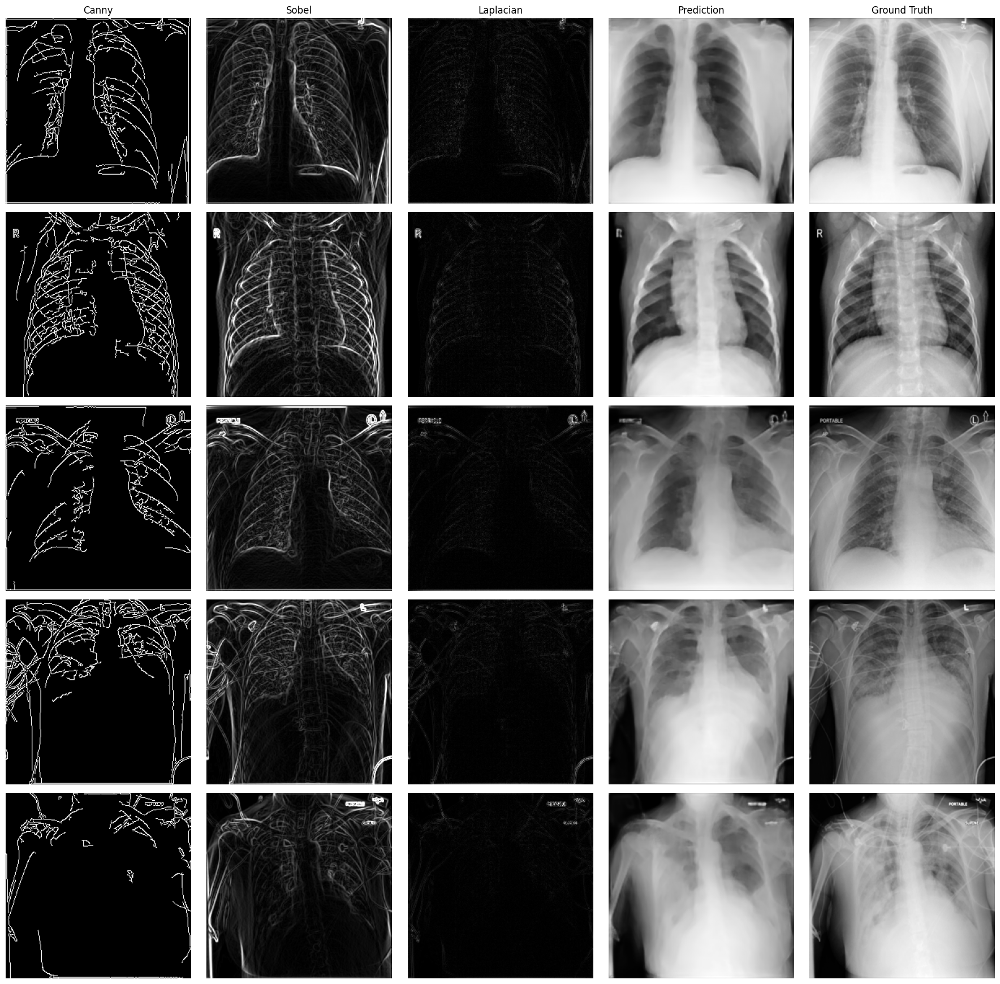
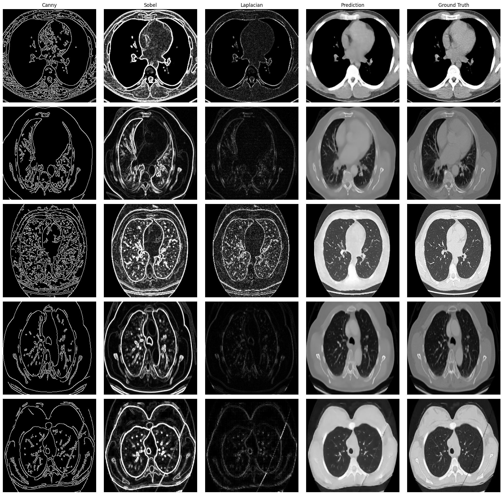
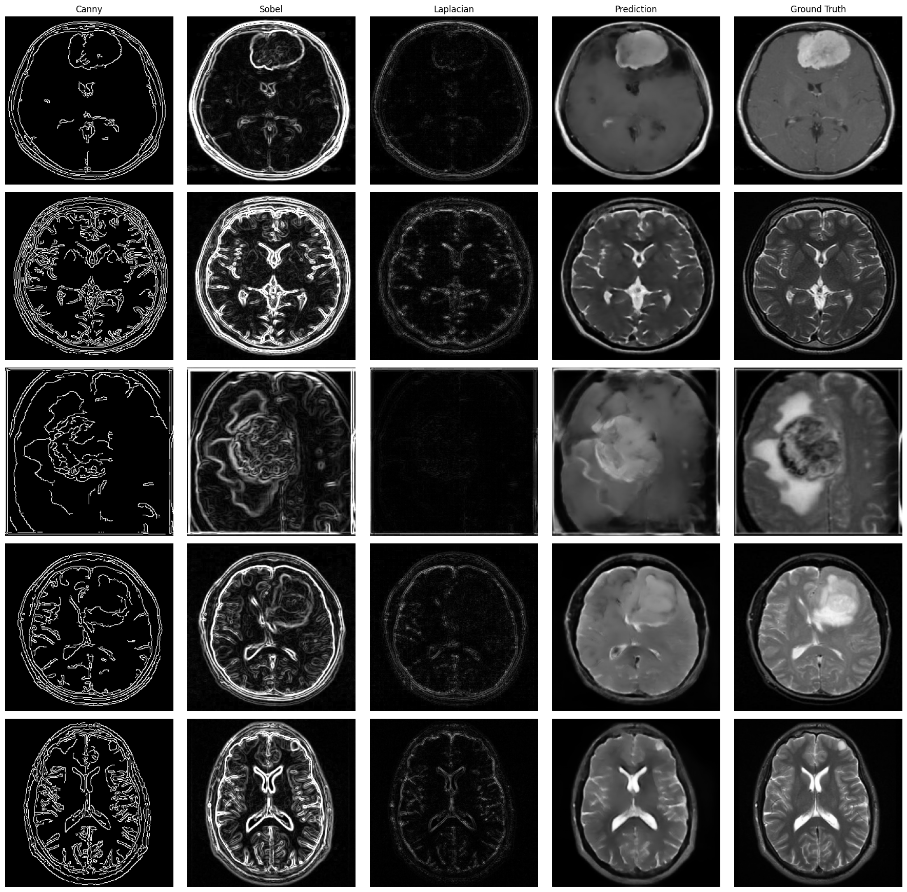
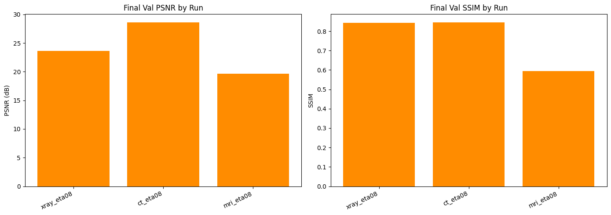
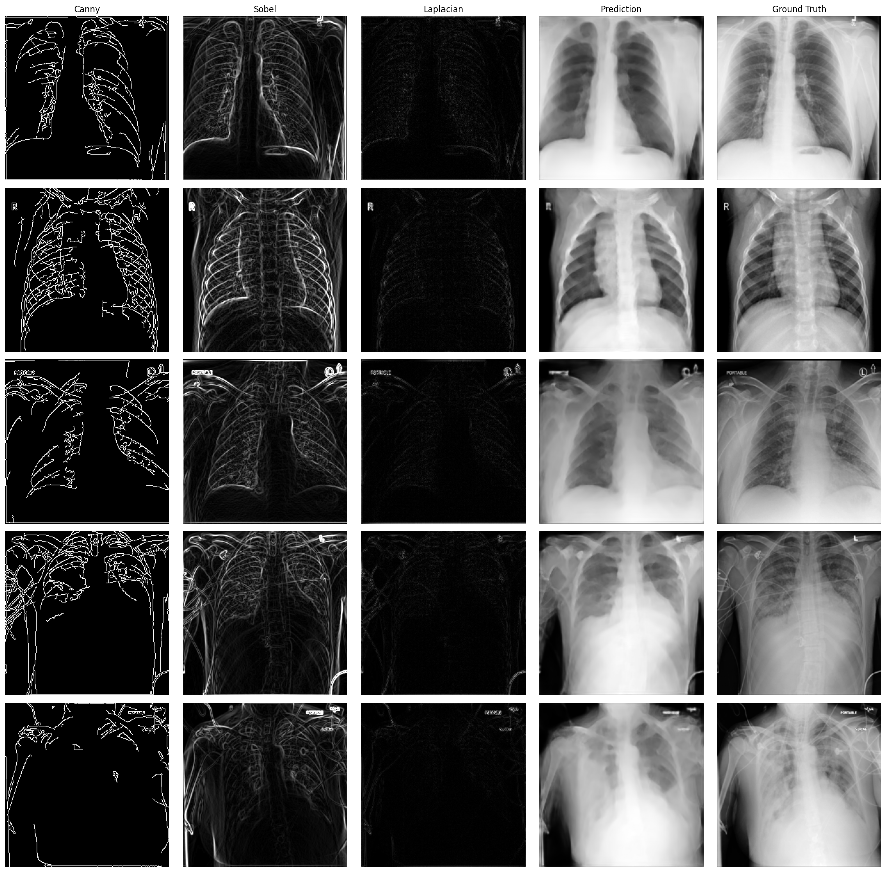
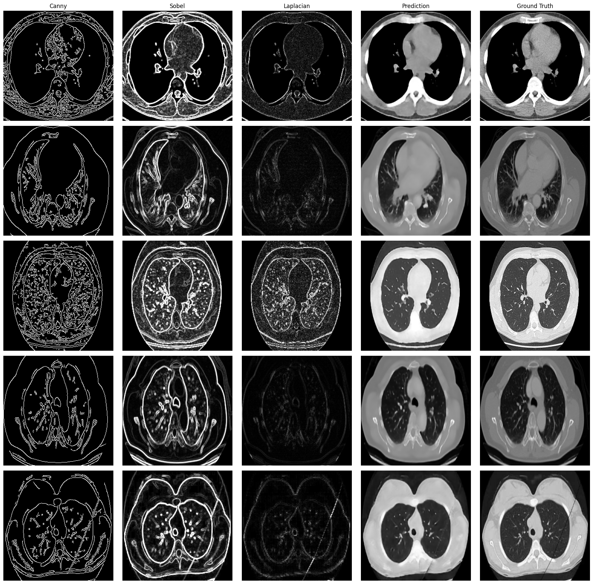
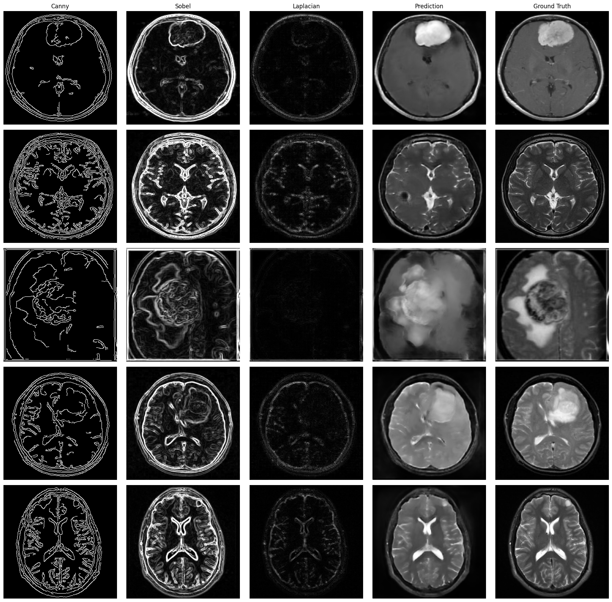

# Medical Image Reconstruction from Edge Features

Reconstructs grayscale medical images from 3-channel edge feature maps (Canny + Sobel + Laplacian) using a ResNet34 U-Net. Two experiments are run across three modalities: X-ray, CT, and MRI.

---

## Setup

```bash
uv sync
```

### Datasets

Download and place under `data/` (not tracked by git):

| Modality | Dataset | Link |
|----------|---------|------|
| X-ray | COVID-19 Radiography Database | [Kaggle](https://www.kaggle.com/datasets/tawsifurrahman/covid19-radiography-database) |
| CT | Chest CT Scan Images | [Kaggle](https://www.kaggle.com/datasets/mohamedhanyyy/chest-ctscan-images) |
| MRI | Brain MRI Images for Brain Tumor Detection | [Kaggle](https://www.kaggle.com/datasets/navoneel/brain-mri-images-for-brain-tumor-detection) |

```
data/
├── COVID-19_Radiography_Dataset/   # X-ray
├── Chest_CT_Scan/                  # CT
└── brain_tumor_dataset/            # MRI
```

```bash
# Quick download via Kaggle CLI:
cd data
kaggle datasets download -d tawsifurrahman/covid19-radiography-database --unzip
kaggle datasets download -d mohamedhanyyy/chest-ctscan-images --unzip
kaggle datasets download -d navoneel/brain-mri-images-for-brain-tumor-detection --unzip
```

### Git LFS

Model checkpoints (`*.pth`) are tracked with Git LFS. Pull them after cloning:

```bash
git lfs install
git lfs pull
```

Results (CSVs, PNGs) are committed normally. The `data/` folder is gitignored — download datasets separately.

---

## Experiment 1 — Baseline

Standard supervised training with L1 loss over all pixels (η=0). Runs all three modalities sequentially. Already-completed runs are skipped automatically.

```bash
uv run scripts/run_baseline.py
```

### Results

| Modality | PSNR (dB) | SSIM | Train Loss | Val Loss |
|----------|-----------|------|------------|----------|
| X-ray    | 24.53     | 0.849 | 0.027     | 0.048    |
| CT       | 29.04     | 0.854 | 0.026     | 0.025    |
| MRI      | 19.57     | 0.616 | 0.050     | 0.076    |



**X-ray** — global structure (lung fields, ribs, mediastinum) reconstructed well. Tight train/val gap indicates good generalisation.

**CT** — best reconstruction. CT slices have sharp, consistent tissue boundaries that Canny/Sobel encode faithfully, giving the model highly informative input features.

**MRI** — weakest. Soft-tissue contrast is gradual rather than sharp, so edge maps carry less information. Interior detail is blurry and tumour regions are only vaguely captured.

### Reconstruction grids (Canny | Sobel | Laplacian | Prediction | Ground Truth)

**X-ray**


**CT**


**MRI**


---

## Experiment 2 — Sparsely Supervised Diffusion (SSD)

Adapts the SSD masking strategy from [arXiv 2602.02699](https://arxiv.org/abs/2602.02699). During training, a random binary mask is applied to the loss — the model is only penalised on the unmasked fraction of output pixels (fraction = 1−η), forcing it to use global context rather than local texture.

```python
mask = torch.bernoulli(torch.full_like(target, 1.0 - eta))
loss = (F.l1_loss(output, target, reduction="none") * mask).sum() / mask.sum()
```

### Usage

```bash
# Single eta, one modality:
uv run scripts/run_ssd.py --eta 0.8 --modalities xray

# Single eta, all modalities:
uv run scripts/run_ssd.py --eta 0.8 --modalities xray ct mri

# Full sweep (eta 0.0, 0.5, 0.8, 0.95 on xray, then best eta auto-applied to ct + mri):
uv run scripts/run_ssd.py

# Skip the automatic ct/mri phase 2:
uv run scripts/run_ssd.py --no-phase2

# Override training length or dataset size:
uv run scripts/run_ssd.py --eta 0.8 --modalities xray --epochs 100 --n-train 1000
```

### Results at η=0.8

| Modality | Baseline PSNR | SSD PSNR | Δ PSNR | Baseline SSIM | SSD SSIM | Δ SSIM |
|----------|--------------|----------|--------|---------------|----------|--------|
| X-ray    | 24.53        | 23.61    | -0.92  | 0.849         | 0.843    | -0.006 |
| CT       | 29.04        | 28.60    | -0.44  | 0.854         | 0.845    | -0.009 |
| MRI      | 19.57        | 19.66    | +0.09  | 0.616         | 0.595    | -0.021 |



**Finding:** SSD marginally hurt X-ray and CT and had no meaningful effect on MRI. SSD was designed to fix memorisation in generative diffusion models trained on small datasets. A U-Net with an ImageNet-pretrained encoder trained on 500 images does not exhibit that memorisation problem — masking only removes useful supervision signal without providing a benefit. The near-neutral result on MRI is consistent with the hypothesis direction (MRI benefits most from global context) but the effect is too small to be conclusive.

### Reconstruction grids at η=0.8

**X-ray**


**CT**


**MRI**


---

## Project structure

```
medical_reconstruction/
├── data/                        # datasets (not tracked)
├── results/                     # per-run outputs (auto-created)
├── src/medrecon/
│   ├── config.py                # ExperimentConfig dataclass
│   ├── dataset.py               # edge feature extraction
│   ├── loaders.py               # per-modality DataLoaders
│   ├── model.py                 # ResNet34 U-Net
│   ├── losses.py                # ssd_loss()
│   ├── metrics.py               # MAE, PSNR, SSIM
│   ├── trainer.py               # training loop + CSV logging
│   └── visualize.py             # grids and charts
└── scripts/
    ├── run_baseline.py          # Experiment 1
    └── run_ssd.py               # Experiment 2
```

Each run saves to `results/{modality}_eta{eta}/`:
- `metrics.csv` — epoch-level train/val loss, PSNR, SSIM
- `best_model.pth` — checkpoint at best val loss
- `grid.png` — reconstruction grid (5 columns × 5 images)
- `curves.png` — loss and metric curves over epochs
